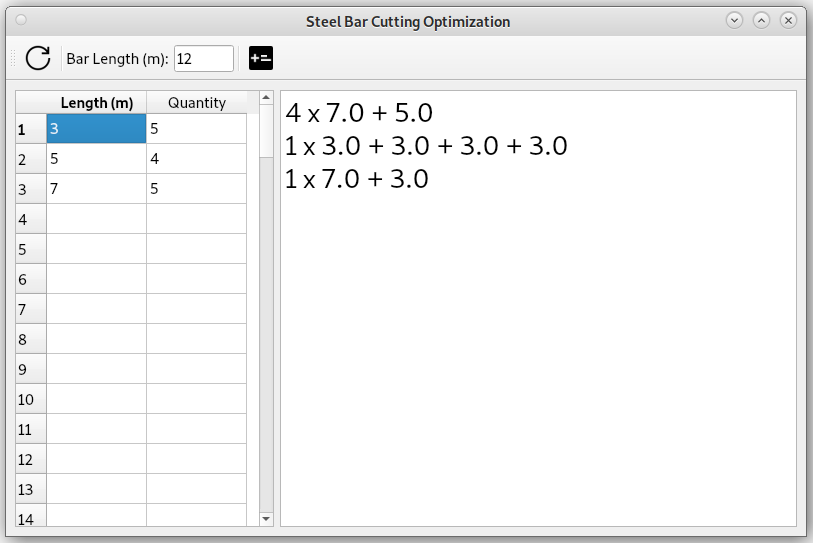
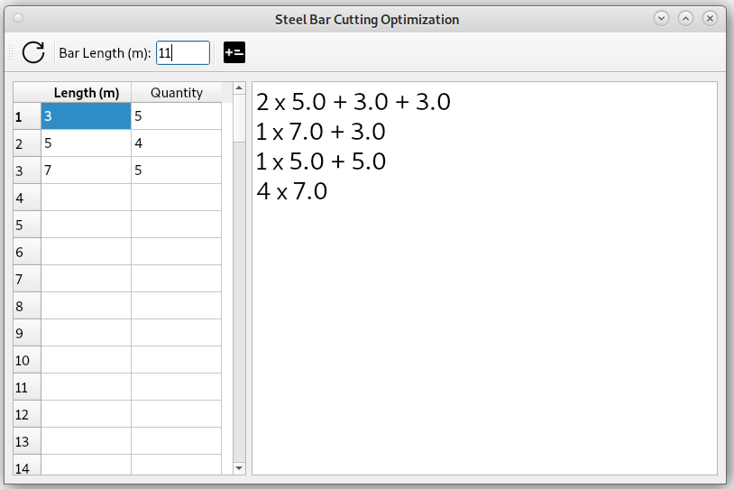
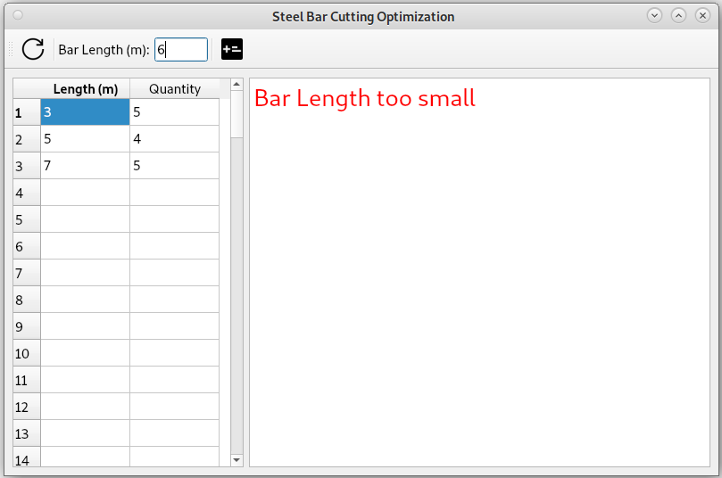

# Bar Cutting Optimizer

The bar cutting optimizer helps to find the best way of cutting bars. 

This is actually not an easy task because there are many possible combinations and it must be defined what can be considered as "better".

In this implementation, a cutting considered to be better if it produces the smallest remaining part. If the remaining part is the same, then the cutting with the longest bar is preferred.


# Implementation

The optimization algorithm works as follows:

1. Create the cutting possibility tree for one bar based on the target values.
2. Convert the possibility tree to a cutting possibility list.
3. Select the best cutting possibility among the list.
4. Remove the selected possibility from the target and repeat from step 1, as long as bars needed.


# Getting started

```shell
git clone git@github.com:flokapi/bar-cutting-optimizer.git
cd bar-cutting-optimizer
python3 src/main.py
```


# Example







